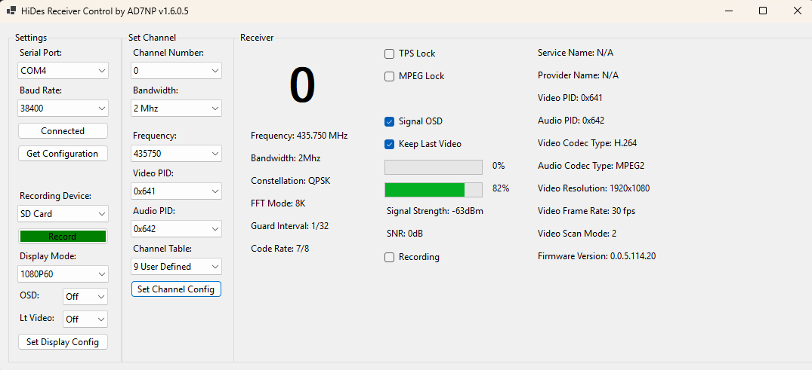

# HiDesReceiverCtrl
HiDes Receiver Control  is a Windows Aplication (.NET 8) to control the HiDes HV-120 and HV-110 DATV receivers.

It was built to control the [WWATS](https://www.qsl.net/ww7ats/)
 DATV repeater multiple receivers.

It is a collaboration between AD7NP and W7ITL

Feel free to create an issue if you have a bug to report or a suggestion.

